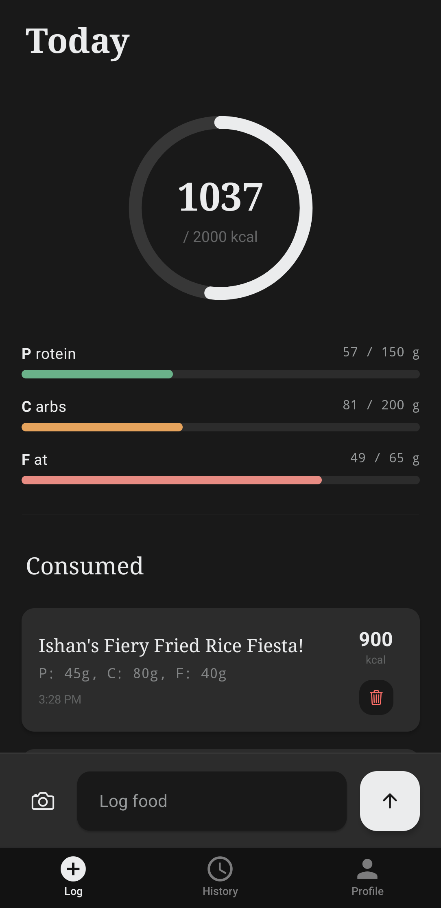

# Noob Diet 🥗

A modern, AI-powered diet tracking application built with Expo and Gemini AI. Log your meals with simple text or photos, and let AI handle the nutrient breakdown.



## ✨ Features

-   **🤖 AI Food Logging**: Simply type what you ate or snap a photo. Our Gemini-powered engine identifies the food and calculates macros automatically.
-   **📸 Image Recognition**: Support for multiple image uploads per entry to accurately capture complex meals.
-   **📊 Macro Dashboard**: Track Calories, Protein, Carbohydrates, and Fat with beautiful, Notion-inspired visualizations.
-   **📅 Historical Tracking**: A sleek calendar interface to browse through your past meals and daily summaries.
-   **👤 Personalized Profiles**: Set your target macros and watch your progress toward your health goals.
-   **🎨 Premium Design**: A clean, minimalist aesthetic with support for both light and dark modes.

## 🚀 Tech Stack

-   **Framework**: [Expo](https://expo.dev/) (React Native)
-   **Language**: TypeScript
-   **Database**: [SQLite](https://docs.expo.dev/versions/latest/sdk/sqlite/) (via `expo-sqlite`)
-   **AI Engine**: [Google Gemini AI](https://ai.google.dev/)
-   **State Management**: React Hooks & Context
-   **Styling**: Vanilla React Native StyleSheet with a custom theme system

## 🛠️ Getting Started

### Prerequisites

-   [Bun](https://bun.sh/) (recommended) or Node.js
-   [Expo Go](https://expo.dev/go) app on your physical device or an emulator
-   [Gemini API Key](https://aistudio.google.com/)

### Installation

1.  **Clone the repository**:
    ```bash
    git clone https://github.com/yourusername/noob_diet.git
    cd noob_diet
    ```

2.  **Install dependencies**:
    ```bash
    bun install
    # or
    npm install
    ```

3.  **Start the development server**:
    ```bash
    bun start
    # or
    npm start
    ```

4.  **Run on your device**:
    Scan the QR code with the Expo Go app.

## 📖 Usage

1.  **Log Food**: Go to the Home tab. Type your meal (e.g., "Chicken breast with rice and broccoli") or tap the camera icon to upload a photo.
2.  **Submit**: Hit the send button to see the AI breakdown, then "Submit" to save it to your daily log.
3.  **View History**: Use the Explore tab to see your progress over time. Tap any day on the calendar to see that day's specific entries.
4.  **Manage Goals**: Use the Profile tab to set your target weight and daily calorie/macro goals.

## 🤝 Contributing

Contributions are welcome! Please feel free to submit a Pull Request.

## 📜 License

This project is licensed under the MIT License - see the [LICENSE](LICENSE) file for details.

---

Built with ❤️ for better health.
